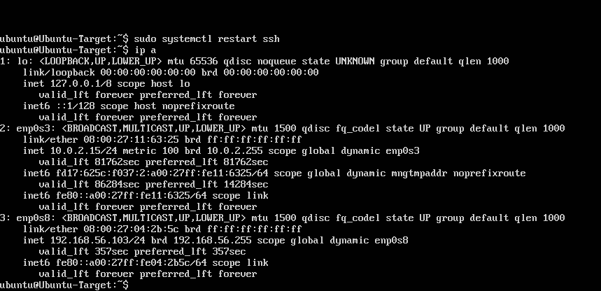
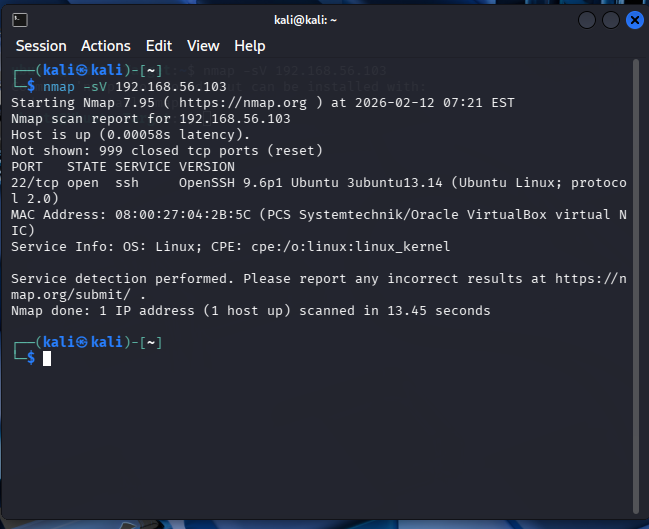
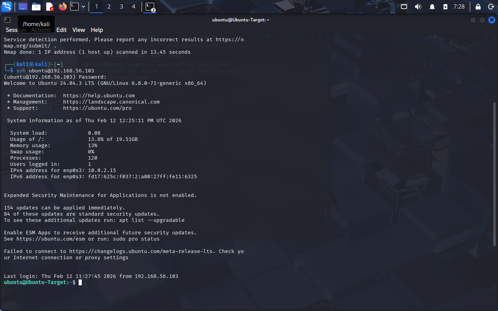
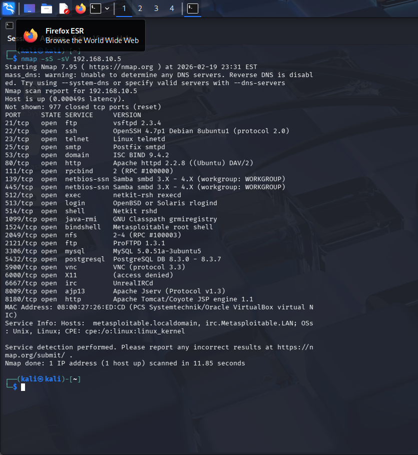
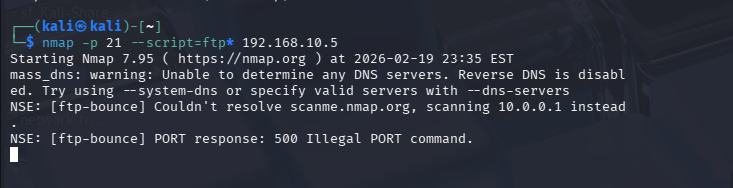
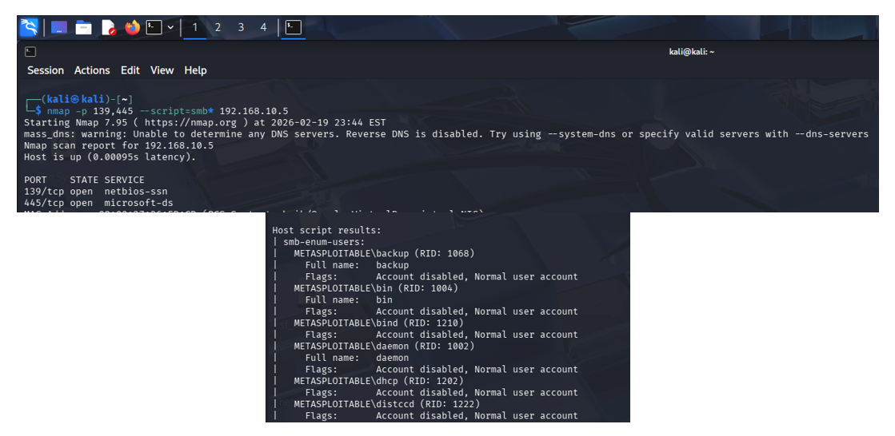

# Lab 1 — Virtual Network Reconnaissance and SSH Access

## Objective
The objective of this lab was to configure a virtual network environment, perform host discovery and service enumeration, and establish a secure remote connection using SSH.

## Lab Environment
- Attacker Machine: Kali Linux
- Target Machine: Ubuntu Server 24.04
- Virtualization: VirtualBox
- Network Configuration: NAT + Host-Only Adapter

## Tools Used

- Nmap
- Nmap Scripting Engine (NSE)
- SSH
- Linux networking utilities (ip, ping)
- FTP enumeration scripts
- SMB enumeration scripts

## Steps Performed

1. Configured virtual networking between Kali Linux and the Ubuntu target machine.
2. Verified network connectivity using `ip a` and `ping`.
3. Conducted SYN and service version scan using Nmap.
4. Performed FTP service enumeration using Nmap NSE scripts.
5. Performed SMB user enumeration on ports 139 and 445.
6. Identified open SSH service on the target system.
7. Successfully established SSH connection from Kali Linux to the Ubuntu server.

## Key Findings

- Target host was successfully discovered on the network.
- Multiple open ports were identified including FTP (21), SMB (139/445), and SSH (22).
- SMB enumeration revealed valid system user accounts on the target machine.
- FTP service responded to enumeration attempts, indicating potential for further analysis.
- Secure remote access via SSH was successfully established.

## Evidence

### IP Address Verification

### Nmap Service Detection Scan

### SSH Login Verification

### SYN Service Version Scan

### FTP Service Enumeration

### SMB User Enumeration

## Key Skills Demonstrated
- Virtual network configuration using VirtualBox
- Network reconnaissance and host discovery
- Service enumeration using Nmap
- Identification of exposed SSH services
- Secure remote access using SSH
- Basic attacker/target lab architecture setup
