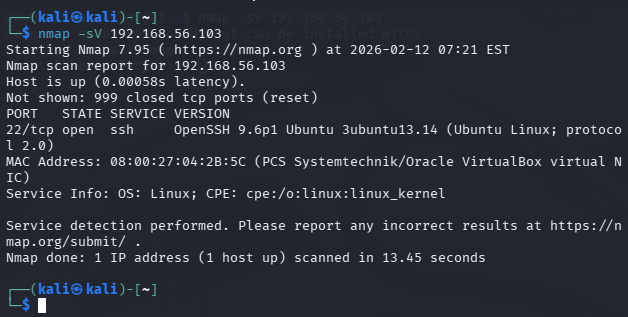
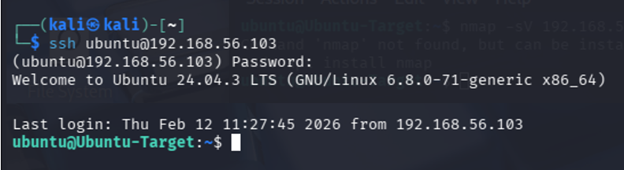

# Lab 1 — Virtual Network Reconnaissance and SSH Access

## Objective
The objective of this lab was to configure a virtual network environment, perform host discovery and basic service detection, and establish a secure remote connection using SSH.

---

## Lab Environment

- Attacker Machine: Kali Linux
- Target Machine: Ubuntu Server 24.04
- Virtualization Platform: VirtualBox
- Network Configuration: NAT + Host-Only Adapter

---

## Tools Used

- Nmap
- SSH
- Linux networking utilities (`ip`, `ping`)

---

## Steps Performed

1. Configured virtual networking between Kali Linux and Ubuntu target machine.
2. Verified network connectivity using `ip a` and `ping`.
3. Conducted a SYN service detection scan using Nmap.
4. Identified open SSH service on the target system.
5. Successfully established SSH connection from Kali Linux to the Ubuntu server.

---

## Key Findings

- Target host was successfully discovered on the host-only network.
- Port 22 (SSH) was open and accessible.
- Remote login via SSH was successfully established.

---

## Evidence

---

## Key Skills Demonstrated

- Virtual network configuration using VirtualBox
- Network reconnaissance and host discovery
- Service detection using Nmap
- Identification of exposed SSH services
- Secure remote access using SSH
- Basic attacker/target lab architecture setup
