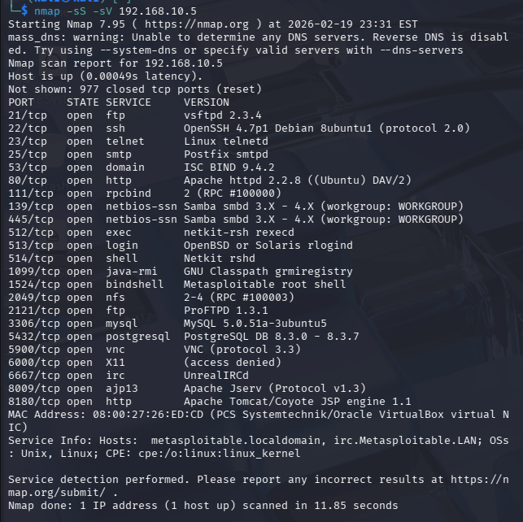

# Lab 2 — Service Enumeration and Analysis

## Objective
Perform service enumeration on identified open ports to gather information about exposed services on the target system.

## Lab Environment

- Attacker Machine: Kali Linux
- Target Machine: Metasploitable / Ubuntu Server
- Virtualization: VirtualBox
- Network Configuration: NAT + Host-Only Adapter

## Tools Used

- Nmap
- Nmap Scripting Engine (NSE)
- FTP enumeration scripts
- SMB enumeration scripts

## Steps Performed

1. Conducted SYN and service version scan using Nmap.
2. Identified open FTP (21) and SMB (139/445) ports.
3. Used Nmap FTP scripts to enumerate FTP service.
4. Used Nmap SMB scripts to enumerate SMB shares and users.

## Key Findings

- FTP service responded to enumeration attempts.
- SMB service exposed valid system user accounts.
- Multiple open services increase potential attack surface.

## Evidence

### SYN Service Version Scan

### FTP Service Enumeration

### SMB User Enumeration

