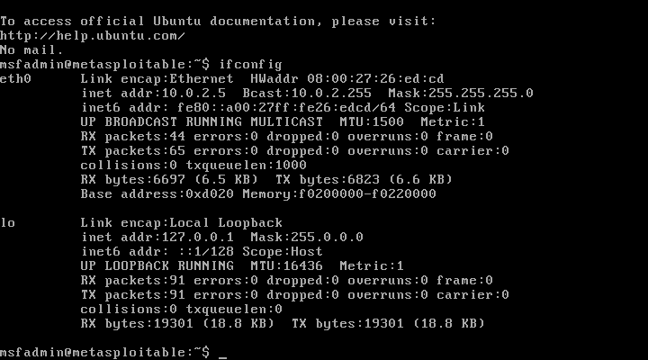
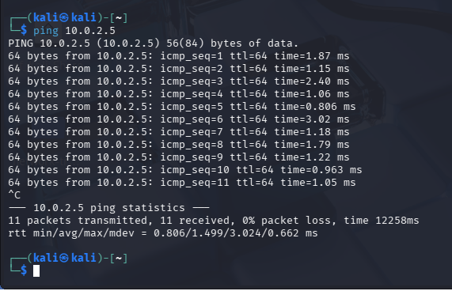
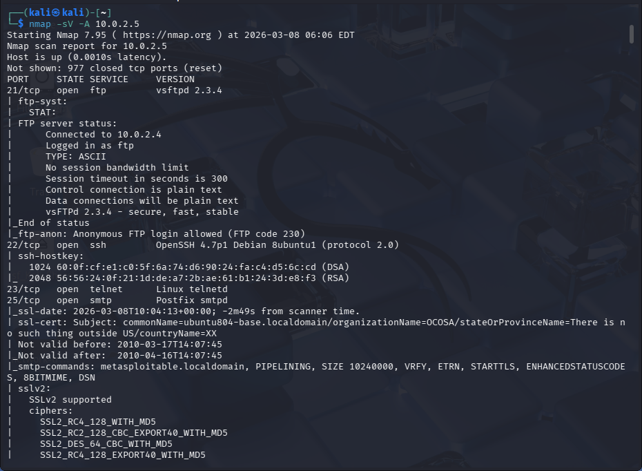
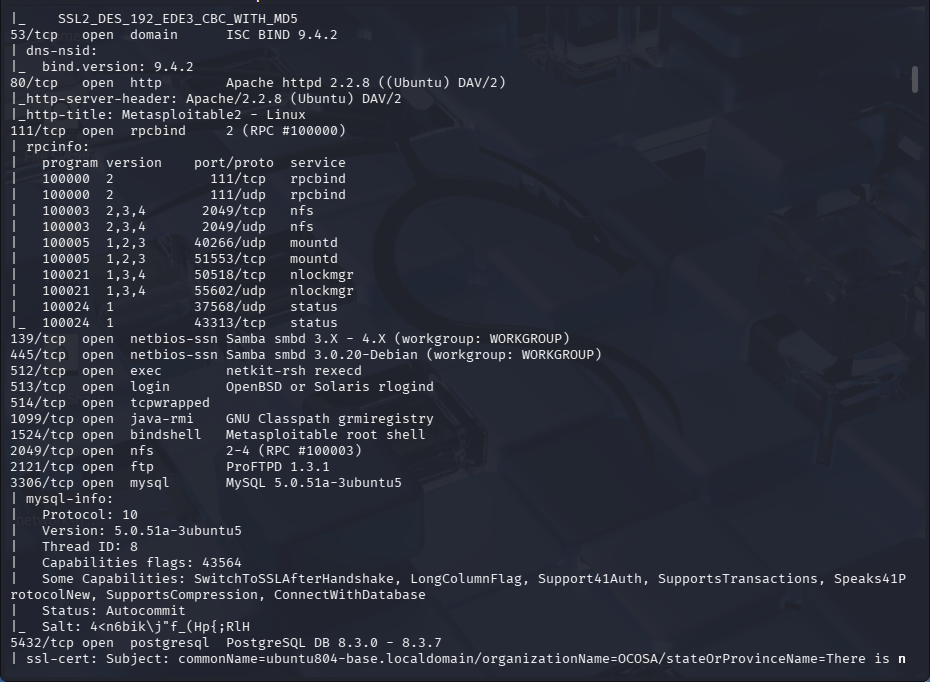
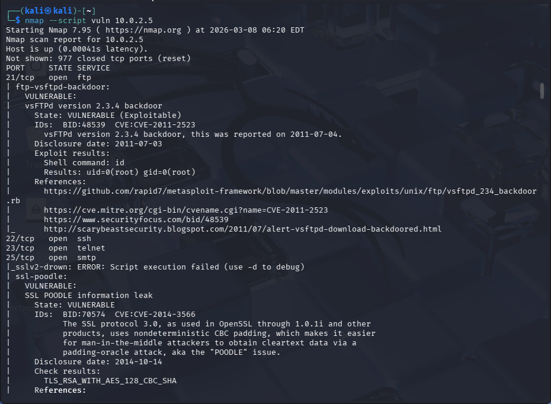

# Lab 3 – Vulnerability Scanning with Nmap

## Objective

The objective of this lab is to perform vulnerability scanning against a vulnerable virtual machine using Nmap. The scan identifies open ports, running services, and known vulnerabilities that could potentially be exploited by attackers.

---

## Lab Environment

The lab environment consists of two virtual machines running in VirtualBox:

* **Kali Linux** – Attacking machine used for reconnaissance and vulnerability scanning
* **Metasploitable 2** – Intentionally vulnerable Linux system used as the target

Both systems are configured on the same virtual network to allow communication between them.

### Tools Used

* **Kali Linux**
* **Metasploitable 2**
* **Nmap**
* **VirtualBox**

---

# Step 1 – Identify Target IP Address

The first step is to determine the IP address of the Metasploitable target system.

Command used on the Metasploitable machine:

```
ifconfig
```

Screenshot:



The target system was assigned the IP address:

```
10.0.2.5
```

---

# Step 2 – Verify Network Connectivity

Before performing scans, connectivity between the Kali Linux machine and the Metasploitable target must be verified.

Command used:

```
ping 10.0.2.5
```

Screenshot:



Successful replies confirm that the attacker machine can communicate with the target system.

---

# Step 3 – Service and Version Detection

A service and version detection scan was performed using **Nmap** to identify running services and software versions on the target system.

Command used:

```
nmap -sV -A 10.0.2.5
```

This scan enables service detection, operating system detection, and additional enumeration features. Nmap gathers detailed information about services running on the target machine.

---

## Initial Results

### Service Scan 1



---

## Additional Enumeration

### Service Scan 2



---

## Key Findings

The scan revealed multiple open ports and services running on the target system, including:

* **FTP** – vsFTPd 2.3.4
* **SSH** – OpenSSH
* **Telnet** – Linux Telnet service
* **SMTP** – Postfix mail server
* **HTTP** – Apache web server
* **Samba (SMB)** – File sharing services
* **MySQL** – MySQL database server

These services represent potential attack surfaces and should be further analyzed for known vulnerabilities.

---

# Step 4 – Vulnerability Scanning

To identify known vulnerabilities associated with the discovered services, an Nmap vulnerability script scan was performed.

Command used:

```
nmap --script vuln 10.0.2.5
```

Screenshot:



---

## Vulnerabilities Identified

The Nmap vulnerability scan detected multiple known vulnerabilities associated with services running on the target system..

### vsFTPd Backdoor (CVE-2011-2523)

The FTP service running on the target system is vulnerable to a known backdoor present in **vsFTPd version 2.3.4**. This vulnerability could allow an attacker to gain unauthorized shell access to the system.

### SSL POODLE Vulnerability (CVE-2014-3566)

The scan also detected the SSL POODLE vulnerability, which affects systems using the outdated SSLv3 encryption protocol. Attackers may exploit this weakness to decrypt secure communications using a padding oracle attack.

---

# Conclusion

This lab demonstrated how vulnerability scanning can be used to identify potential security weaknesses in a system.

Using Nmap, the following tasks were completed:

* Identified the target system IP address
* Verified connectivity between attacker and target
* Enumerated open ports and running services
* Detected known vulnerabilities associated with those services

These steps represent a fundamental phase of penetration testing and vulnerability assessment. Vulnerability scanning helps security professionals identify risks early so they can be mitigated before attackers exploit them.
